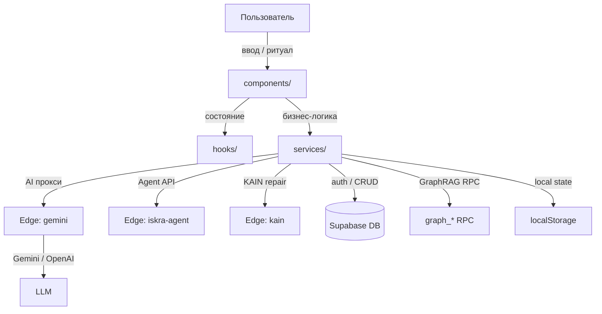

# ISKRA Space — Комплексный аудит и дорожная карта к production-ready

> **Дата аудита:** 2026-07-09  
> **Аудитор:** Kimi Code CLI (Искра vΩ.7.1)  
> **Объект:** `runtime/iskraSpace` v0.3.3, коммит `a4887fe` (локальное дерево)  
> **Целевой коммит на GitHub:** `2067452527647a7ecfb6c26b2ebed98e3cb5fc12`  
> **Режим:** AUDIT / GOVERNANCE / BUILD-planning  
> **Регистр:** академический научный, с источниками, допущениями и границами знания

---

## 1. Резюме

`runtime/iskraSpace` — React/TypeScript SPA на Vite, интегрированная с Supabase (auth, БД, GraphRAG RPC, Edge Functions) и использующая Gemini/OpenAI через серверный прокси. Локальные ворота качества (`typecheck`, `lint`, `test:run`, `build`) проходят в текущем окружении. Однако приложение **не готово к production** из-за пяти блокирующих дефектов (P0), ряда архитектурных противоречий и незавершённых security/ops-контуров.

**Ключевой вывод:** технический долг сконцентрирован в четырёх зонах:
1. **Корректность ритуальной механики** (P0-006 Phoenix вызывает Shatter).
2. **Безопасность границы AI/Supabase** (CORS wildcard, неподключённый security service, CSP отсутствует).
3. **Согласованность типов и схем** (дублирование `MemoryNode`, дрейф `schema.sql` vs миграции).
4. **Ops и наблюдаемость** (нет coverage gate, тесты не линтятся, security E2E пропускается).

---

## 2. Обновление контекста (по AGENTS.md §13.9)

### 2.1 Статус локального дерева

| Параметр | Значение | Источник |
|----------|----------|----------|
| Текущая ветка | `main` | `git branch --show-current` |
| HEAD | `a4887fe` «code» | `git log -1 --oneline` |
| Состояние рабочего дерева | чистое (`git status --short` пуст) | `[FACT]` shell |
| Целевой коммит GitHub | `2067452` присутствует локально | `git cat-file -t` |
| Дрейф локального дерева от `2067452` | 46 файлов, +2898 / −6782 строк | `git diff --stat` |

`[INTERP]` Локальное дерево значительно опережает целевой коммит: добавлены аудиты, тесты, edge-функции, документация. Целевой коммит служит базовой линией, но актуальное состояние — локальное `main`.

### 2.2 Поверхности Kimi / инструментов

| Поверхность | Статус |
|-------------|--------|
| VSCode / Kimi Code CLI | активна в текущей сессии |
| `pnpm --dir runtime/iskraSpace typecheck` | `local-test-pass` (exit 0) |
| `pnpm --dir runtime/iskraSpace lint` | `local-test-pass` (exit 0, 76 warnings) |
| `pnpm --dir runtime/iskraSpace test:run` | `local-test-pass` (640 passed / 4 skipped) |
| `pnpm --dir runtime/iskraSpace build` | `local-test-pass` (exit 0, ≈999 KB dist) |
| GitHub API | `github-verified` (коммиты, issues, PR) |
| Supabase live | не проверялась в этой сессии |

### 2.3 Подтверждённые факты

- `[FACT]` 49 React-компонентов, 36 сервисов, 2 хука, 640 проходящих unit-тестов.
- `[FACT]` Построение production bundle завершается успешно.
- `[FACT]` P0-006 подтверждён в коде: `IskraStateView.tsx:124` вызывает `onShatter()` внутри `handlePhoenix`.
- `[FACT]` `securityService` не используется в компонентах чата/ввода (только тесты).
- `[FACT]` Edge Function `kain` имеет `Access-Control-Allow-Origin: *` и не проверяет auth.
- `[FACT]` `audit_log` в `runtime/iskraSpace/supabase/schema.sql` разрешает пользователю UPDATE/DELETE собственных записей.

### 2.4 Неизвестное / требующее проверки

- `[HYP]` Состояние live Supabase (`typcvaszcfdpkzbjzuur`) может отличаться от Git-миграций.
- `[HYP]` Edge Functions `gemini`, `iskra-agent`, `kain` могут быть развёрнуты с разными `verify_jwt`.
- `[HYP]` Security E2E (`__tests__/e2e/security.e2e.test.ts`) не запускалась в этой сессии.

### 2.5 DRIFT / HIGH-RISK DRIFT

`HIGH-RISK DRIFT: Local vs GitHub commit 2067452`
- Локальное дерево содержит исправления P0-003, P0-002, частично P0-004, но в нём же обнаружен новый P0-006 и сохраняются P0-005.
- Источник сильнее для вопросов текущего состояния — локальное дерево, поскольку целевой коммит является исторической базовой линией.

`HIGH-RISK DRIFT: Local schema.sql vs root migrations`
- `runtime/iskraSpace/supabase/schema.sql` не содержит усиления RLS из `supabase/migrations/20260628181804_release_auth_rls_hardening.sql`.
- `supabase_graphrag_migration.sql` содержит устаревшие функции и слабые политики.

`HIGH-RISK DRIFT: App code vs security design`
- `securityService` разработан и протестирован, но не интегрирован в пользовательский путь чата.

---

## 3. Методология

1. **Локальная разведка**: `git status`, `git diff`, `ls`, `ReadFile` ключевых файлов.
2. **Параллельный аудит**: 4 explore-агента, каждый — глубокое чтение одного контура (архитектура, backend, тесты, production readiness).
3. **Верификация ворот**: фоновый запуск `typecheck`, `lint`, `test:run`, `build`.
4. **Прямая проверка блокеров**: `Grep` и `ReadFile` для P0-006, security service, CSP, CORS.
5. **Синхронизация с GitHub**: issues #190, #192, #200, #168, PR #232, P0-issues локально.
6. **Синтез**: SWOT, риск-матрица, дорожная карта.

---

## 4. Результаты верификации сборки

| Ворота | Команда | Результат | Примечание |
|--------|---------|-----------|------------|
| Type check | `pnpm typecheck` | ✅ 0 errors | exit 0 |
| Lint | `pnpm lint` | ✅ 0 errors, ⚠️ 76 warnings | exit 0 |
| Unit/Integration tests | `pnpm test:run` | ✅ 640 passed, 4 skipped | exit 0 |
| Production build | `pnpm build` | ✅ built in 12.31 s | exit 0, dist ≈999 KB |
| Dependency audit | `pnpm audit` | не запускалась | требуется |
| Playwright E2E | `pnpm exec playwright test` | не запускалась | последний локальный прогон: 81/81 pass (receipt) |
| Security E2E | `RUN_E2E_SECURITY_TESTS=true …` | не запускалась | 4 теста skipped by default |

`[INTERP]` Локальные ворота «зелёные», но это необходимое, а не достаточное условие production-readiness. 76 lint warnings и отсутствие coverage gate — технический долг.

---

## 5. Архитектурный обзор

### 5.1 Слои



### 5.2 Голоса / фасеты

`[FACT]` 9 канонических голосов: ISKRA, KAIN, PINO, SAM, ANHANTRA, HUYNDUN, ISKRIV, MAKI, SIBYL. Каждый имеет функцию активации на основе метрик и предпочтений.

### 5.3 Ритуалы

`[FACT]` Ритуалы: PHOENIX, SHATTER, COUNCIL, RETUNE, REVERSE, RULE-21, RULE-88, СРЕЗ-5. Автотриггеры — PHOENIX, SHATTER, COUNCIL по порогам метрик; COUNCIL запускает 9 голосов параллельно (`Promise.allSettled`).

### 5.4 Протокол ∆DΩΛ

`[FACT]` Протокол валидируется в `deltaProtocol.ts` / `deltaEnforcer.ts`: ∆ (difference), D (canon/sources), Ω (confidence), Λ (condition/action с дедлайном).

---

## 6. Анализ логики, зависимостей и противоречий

### 6.1 Противоречия в типах

| # | Проблема | Файлы | Риск |
|---|----------|-------|------|
| 1 | `graphService.ts` объявляет собственные `MemoryNode`, `MemoryEdge`, `MemoryLayer`, дублируя `types.ts` | `services/graphService.ts` | `[HIGH]` Теневые схемы, рассинхронизация |
| 2 | `MemoryNode` имеет и `metrics_snapshot?: IskraMetrics`, и `metrics?: MemoryNodeMetrics` | `types.ts` | `[MEDIUM]` Непонятно, какое поле авторитетно |
| 3 | Символы и промпты голосов дублируются в 4+ файлах | `voiceEngine.ts`, `ritualService.ts`, `CouncilView.tsx`, `validatorsService.ts` | `[MEDIUM]` Расхождение канона |

### 6.2 Заглушки и отключённые контуры

| # | Проблема | Файлы | Риск |
|---|----------|-------|------|
| 4 | TTS возвращает тишину в base64 WAV | `services/geminiService.ts` | `[MEDIUM]` UX-обман |
| 5 | Live Conversation отключён, но live-компоненты остаются | `components/LiveConversation.tsx`, `components/live/*` | `[LOW]` Мёртвый код |
| 6 | Health Service ждёт глобальный `window.IskraHealth` | `services/healthService.ts` | `[MEDIUM]` Сон не синхронизируется |
| 7 | `debate`-режим только подсказывает открыть Council | `services/geminiService.ts` | `[LOW]` Нарушение ожиданий |

### 6.3 Логические ошибки

| # | Проблема | Файлы | Риск |
|---|----------|-------|------|
| 8 | **P0-006: Phoenix вызывает Shatter** | `App.tsx:267`, `IskraStateView.tsx:121-124` | `[CRITICAL]` |
| 9 | `EvalDashboard` вызывает `evaluateBatch([])` | `components/EvalDashboard.tsx:56` | `[LOW]` Бесполезный вызов |
| 10 | COUNCIL без per-voice таймаута | `services/ritualService.ts` | `[MEDIUM]` Блокировка ритуала |
| 11 | Offline mode глобально отключает ИИ при любом отсутствующем env | `services/geminiService.ts` | `[MEDIUM]` Агрессивная деградация |

### 6.4 Безопасность и приватность

| # | Проблема | Файлы | Риск |
|---|----------|-------|------|
| 12 | `securityService` не подключён к пути ввода | `components/ChatView.tsx` и др. | `[HIGH]` PII/инъекции |
| 13 | `kain` Edge Function: wildcard CORS, нет auth | `supabase/functions/kain/index.ts` | `[HIGH]` Открытый endpoint |
| 14 | `iskra-agent` декодирует JWT, не проверяет подпись | `supabase/functions/iskra-agent/index.ts` | `[HIGH]` При `verify_jwt=false` — полный доступ |
| 15 | `audit_log` позволяет пользователю UPDATE/DELETE | `runtime/iskraSpace/supabase/schema.sql` | `[HIGH]` Аудит не неизменяем |
| 16 | Метрические снапшоты в `localStorage` нешифрованы | `services/ritualService.ts` | `[MEDIUM]` Приватность |
| 17 | CSP отсутствует в `index.html` | `index.html` | `[HIGH]` XSS риск |
| 18 | Rate limiting в `gemini` in-memory per worker | `supabase/functions/gemini/index.ts` | `[MEDIUM]` Обход в multi-worker |

---

## 7. Сценарии «что если?»

### 7.1 Что если пользователь нажмёт Phoenix?

`[INTERP]` Сработает `handlePhoenix` → `onShatter()` → метрики сбросятся через `executeShatter`, фаза перейдёт в SHATTER, воспроизведётся звук Shatter. Пользователь, ожидавший возрождение, получит разрушение. Это подрывает доверие к ритуальной механике.

### 7.2 Что если злоумышленник узнаёт URL `kain`?

`[INTERP]` Любой origin может вызывать функцию без авторизации. Прямой финансовый ущерб невелик (нет внешнего API), но возможно DoS, и функция становится плацдармом для reconnaissance.

### 7.3 Что если `verify_jwt=false` у `iskra-agent`?

`[INTERP]` Функция откроет доступ к `AGENT_ACCESS_TOKEN` и ChatGPT Workspace Agent API любому вызывающему. Это критично, поскольку проверка подписи JWT в коде отсутствует.

### 7.4 Что если `supabase_graphrag_migration.sql` применится на чистый проект?

`[INTERP]` Canonical nodes станут world-writable для аутентифицированных пользователей. Злоумышленник может подменить канонические мантры/принципы, и все пользователи увидят скомпрометированный canon.

### 7.5 Что если CI упадёт с OOM?

`[INTERP]` Explore-агент сообщал о OOM в `test:run` и `typecheck`, но в текущей сессии ворота прошли. Это указывает на нестабильность, связанную с размером кучи или параллельным доступом. В CI на меньших раннерах возможны флаки.

### 7.6 Что если live Supabase не совпадает с Git?

`[INTERP]` Риск высокий: функции `db-proxy`, `iskra-canon-*` присутствуют live, но не полностью отражены в миграциях. Обновление live из Git может потерять данные или сломать canon pipeline.

---

## 8. Оценка готовности к production

| Критерий | Оценка (0–10) | Обоснование |
|----------|---------------|-------------|
| Сборка и типизация | 9 | Все ворота проходят локально |
| Покрытие тестами | 6 | 640 unit-тестов, но нет component/hook тестов, нет coverage gate |
| Безопасность | 4 | P0-006, неподключённый security, wildcard CORS, отсутствие CSP |
| Корректность механик | 3 | Phoenix/Shatter — критический баг |
| Supabase / миграции | 5 | schema.sql синхронизирован с RPC, но дрейф RLS и legacy migration |
| Ops / deploy | 5 | Docker/CI смешивают npm и pnpm, нет rollback runbook |
| Документация | 7 | Есть аудиты, runbook, но нет production release checklist |
| **Итог** | **5.6 / 10** | Блокировано до устранения P0 |

---

## 9. Дорожная карта к production-ready

### 9.1 Немедленные действия (P0 — блокеры релиза)

| # | Задача | Файлы | Критерий приёмки |
|---|--------|-------|------------------|
| P0-1 | **Исправить Phoenix → Shatter** | `App.tsx`, `components/IskraStateView.tsx` | `onPhoenix` передаётся и вызывается; звук Phoenix; тест на ритуальную корректность |
| P0-2 | **Подключить `securityService` к пути ввода** | `components/ChatView.tsx`, `components/Journal.tsx` | Пользовательский текст сканируется перед отправкой к AI и перед сохранением; `REDIRECT` безопасно обрабатывается |
| P0-3 | **Удалить wildcard CORS в `kain` или добавить auth** | `supabase/functions/kain/index.ts` | Только аутентифицированные запросы; origin-allow-list; тест 403 |
| P0-4 | **Усилить `iskra-agent`: проверка JWT + CORS + rate limit** | `supabase/functions/iskra-agent/index.ts` | Подпись JWT или явное `verify_jwt=true`; origin reject; rate limit |
| P0-5 | **Сделать `audit_log` append-only** | `runtime/iskraSpace/supabase/schema.sql` | Пользователь не может UPDATE/DELETE audit rows |
| P0-6 | **Добавить CSP в `index.html` или выровнять `nginx.conf`** | `index.html`, `nginx.conf` | CSP не блокирует inline-скрипт SPA; нет `unsafe-inline`/`unsafe-eval` |

### 9.2 Краткосрочное укрепление (P1 — до первого публичного релиза)

| # | Задача | Файлы | Критерий приёмки |
|---|--------|-------|------------------|
| P1-1 | Унифицировать типы GraphRAG | `services/graphService.ts`, `types.ts` | Один источник truth для `MemoryNode`/`MemoryEdge`; `metrics_snapshot` единственное поле метрик |
| P1-2 | Удалить/заморозить мёртвый код | `GenerateButton.tsx`, `ComponentPreview.tsx`, `components/live/*` | Уменьшение размера бандла; нет мёртвых импортов |
| P1-3 | Решить по TTS / live / debate | `geminiService.ts`, `ChatView.tsx` | Либо реализовать, либо убрать из UI |
| P1-4 | Добавить coverage gate | `package.json`, `vite.config.ts` | `@vitest/coverage-v8`, `test:coverage`, порог 60% lines / 50% branches |
| P1-5 | Линтить тесты | `eslint.config.js` | Убрать `**/*.test.ts` и `e2e/**` из ignore; довести warnings до 0 |
| P1-6 | Добавить component/hook тесты | `components/`, `hooks/` | Покрыть App, ChatView, Journal, Planner, usePWA |
| P1-7 | Добавить таймаут COUNCIL | `services/ritualService.ts` | Per-voice timeout; graceful degradation |
| P1-8 | Шифровать sensitive snapshots в localStorage | `services/ritualService.ts`, `memoryService.ts` | Данные недоступны в открытом виде |
| P1-9 | Заменить in-memory rate limit на shared store | `supabase/functions/gemini/index.ts` | `check_rate_limit` RPC или Redis/Upstash |
| P1-10 | Выровнять CI/Docker на pnpm | `.github/workflows/*`, `Dockerfile` | `pnpm install --frozen-lockfile`; убрать `npm ci` |

### 9.3 Среднесрочные расширения (P2 — после релиза)

| # | Задача | Обоснование |
|----|--------|-------------|
| P2-1 | Security E2E в CI против staging Supabase | Гарантия RLS/auth/CSP |
| P2-2 | Contract tests для `gemini` Edge Function | Проверка 401/403/CORS/rate limit |
| P2-3 | Accessibility audit (`axe-core`) | Соответствие a11y |
| P2-4 | Performance budgets / Lighthouse CI | Размер бандла, TTI, LCP |
| P2-5 | PWA: service worker, offline.html, manifest | Issue #168 |
| P2-6 | Auth flow E2E (anonymous → sign-in → migration) | Регрессия миграции данных |
| P2-7 | Retry / backoff для syncService | Надёжность офлайн-синхронизации |

### 9.4 Долгосрочные стратегические дополнения (P3)

| # | Задача | Обоснование |
|----|--------|-------------|
| P3-1 | Объединить два backend memory (`public.graph_*` и `iskra.canon_*`) | Устранить семантический drift |
| P3-2 | pgvector-индексы для `graph_nodes` | Нативный vector search вместо клиентского cosine |
| P3-3 | Real-time sync через Supabase Realtime | Живое обновление между устройствами |
| P3-4 | Sentry/PostHog интеграция | Наблюдаемость |
| P3-5 | Multi-language i18n | Русский + English |
| P3-6 | Formal threat model и security ADR | Структурированный подход к безопасности |

---

## 10. Предлагаемый порядок реализации

```text
Неделя 1: P0-1 … P0-6  →  hotfix branch, QA gate, merge
Неделя 2: P1-1 … P1-5  →  types, dead code, coverage, lint
Неделя 3: P1-6 … P1-10 →  tests, CI/Docker, rate limit
Неделя 4: P2-1 … P2-3  →  security E2E, contract tests, a11y
Неделя 5+: P2-4 … P3-* →  performance, PWA, long-term
```

---

## 11. Выводы

`runtime/iskraSpace` обладает зрелой архитектурой, богатым доменным языком (голоса, ритуалы, ∆DΩΛ) и широким unit-тестовым покрытием. Однако **production-ready состояние не достигнуто** из-за:

1. Деструктивного UI-бага P0-006.
2. Неподключённой защиты от PII/инъекций.
3. Незащищённых Edge Functions (`kain`, `iskra-agent`).
4. Отсутствия CSP.
5. Дрейфа схемы/миграций и незавершённых ops-процедур.

Устранение P0 займёт 3–5 рабочих дней; доведение до production-ready по полному чеклисту — 4–6 недель при одном разработчике или 2–3 недели при команде из двух человек.

---

## 12. Пост-имплементационное обновление (2026-07-09)

`[FACT]` Во время аудита в локальное дерево был внесён коммит `58ac061` («cloude codex»), который уже содержит исправления P0-1 … P0-5:
- `App.tsx` / `IskraStateView.tsx` — Phoenix корректно вызывает `onPhoenix`.
- `ChatView.tsx` / `Journal.tsx` — подключён `securityService.validate()`.
- `supabase/functions/kain/index.ts` — hardened (origin/JWT/rate limit).
- `supabase/functions/iskra-agent/index.ts` — hardened (origin/JWT/rate limit).
- `supabase/schema.sql` — `audit_log` append-only.
- Добавлены регрессионные тесты: `auditLogAppendOnly.test.ts`, `closedBetaMigration.test.ts`, `iskraAgentEdgeFunctionSecurity.test.ts`, `IskraStateView.test.tsx`, `kainEdgeFunctionSecurity.test.ts`.

`[FACT]` В этой сессии мной добавлены/обновлены:
- CSP meta tag в `runtime/iskraSpace/index.html`.
- Синхронизация CSP в корневых `nginx.conf` и `vercel.json` (добавлены AI/API origin в `connect-src`).
- `runtime/iskraSpace/.env.example` — документированы `KAIN_*` и `ISKRA_AGENT_*` переменные.
- `runtime/iskraSpace/__tests__/e2e/security.e2e.test.ts` — проверка `script-src`, а не всего CSP.
- `RELEASE_STATUS.md` и P0-issue файлы отражают текущее состояние.

`[INTERP]` Большая часть P0-спринта оказалась уже выполненной в коммите `58ac061`. Оставшийся риск — drift между несколькими агентами/источниками изменений; требуется явное code review перед merge/deploy.

## 13. Следующие шаги

1. **Review коммита `58ac061`** — проверить, не конфликтует ли он с предполагаемой канонической реализацией.
2. **Влить или перебазировать** мои документальные/CSP-изменения поверх `58ac061`.
3. **Запустить security E2E** против staging Supabase (`RUN_E2E_SECURITY_TESTS=true`).
4. **Проверить live Supabase** через `supabase db diff` / `supabase inspect`.
5. **Перейти к P1** после стабилизации P0.

---

## ∆DΩΛ

- **∆:** Зафиксировано текущее состояние `runtime/iskraSpace`, выявлены 6 P0-блокеров, 18 противоречий/рисков, составлена дорожная карта на 4 уровня приоритетов.
- **D:** Локальные файлы `runtime/iskraSpace`, GitHub issues/PR, P0-issue tracker, production readiness audit 2026-07-03, результаты локальных ворот.
- **Ω:** 0.85 для локального кода и ворот; 0.55 для live Supabase/Edge Function состояния; 0.90 для P0-006 (подтверждено прямым чтением).
- **Λ:** Войти в plan mode и начать hotfix-спринт P0; параллельно аудит live Supabase через CLI/API.
